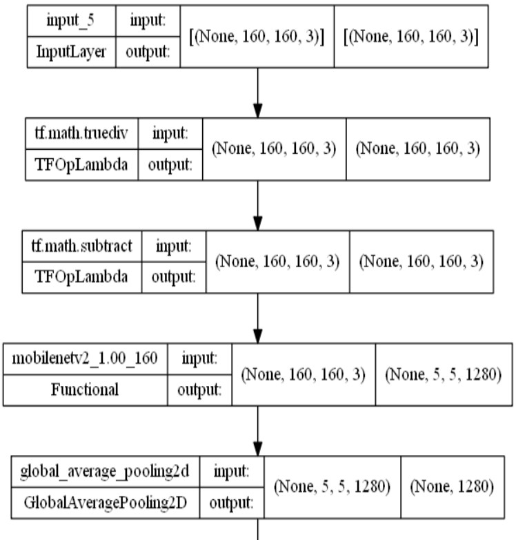
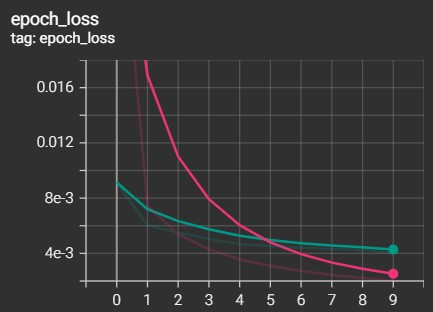
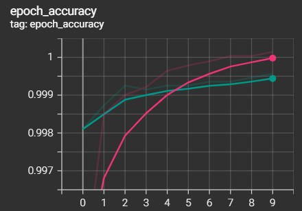
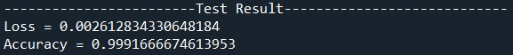
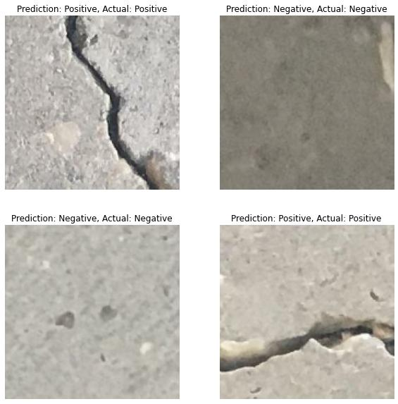

# Identify Cracks on Concrete images with Image Classification

## 1. Objective
To create a convolutional neural network model with high accuracy in which the model will identify cracks on concrete images. The problem is modelled as a binary classification problem (no cracks/negative and cracks/positive). 

## 2. Dataset
The dataset is obtained from [Concrete Crack Images for Classification](https://data.mendeley.com/datasets/5y9wdsg2zt/2). <br />
The dataset is consists of 40000 images (20000 images of concrete in good condition and 20000 images of concrete with cracks).  

## 3. IDE and Framework
- <b>IDE<b>: Sypder
- <b>Frameworks<b>: Numpy, Matplotlib and Tensorflow Keras

## 4. Methodology

### 4.1. Data Pipeline
The image data are loaded along with their respective labels. Then, the data is split into train-validation set, with a ratio of 70:30. The validation data is then further split into two portion by a ratio of 80:20 to obtain some test data. The overall train-validation-test split ratio is 70:24:6. No data augmentation is applied as the data size and variation are already sufficient.

### 4.2. Model Pipeline
The input layer is designed to receive coloured images with a dimension of 160x160. The full shape will be (160, 160, 3).

Transfer learning is applied for building the deep learning model of this project. Firstly, a preprocessing layer is created that will change the pixel values of input images to a range of -1 to 1. This layer serves as the feature scaler and it is also a requirement for the transfer learning model to output the correct signals.

For feature extractor, a pretrained model of MobileNet v2 is used. The model is readily available within TensorFlow Keras package, with ImageNet pretrained parameters. It is also frozen hence will not update during model training.

A global average pooling and dense layer are used as the classifier to output softmax signals. The softmax signals are used to identify the predicted class.

The simplified illustration of the model is shown as figure below.



The model is trained with a batch size of 16 and 10 epochs. After training, the model reaches 99% training accuracy and 95% validation accuracy. The training results are shown in the figures below.

 

The graphs show a clear sign of convergence, indicating the model has been trained to reach an optimal level of accuracy and loss.

## 5. Results
The model is evaluated with the test data. The loss and accuracy are shown in figure below.



Some predictions are also been made with the model, and compared with the actual results.




## 6. License
```
MIT License

Copyright (c) [year] [fullname]

Permission is hereby granted, free of charge, to any person obtaining a copy
of this software and associated documentation files (the "Software"), to deal
in the Software without restriction, including without limitation the rights
to use, copy, modify, merge, publish, distribute, sublicense, and/or sell
copies of the Software, and to permit persons to whom the Software is
furnished to do so, subject to the following conditions:

The above copyright notice and this permission notice shall be included in all
copies or substantial portions of the Software.

THE SOFTWARE IS PROVIDED "AS IS", WITHOUT WARRANTY OF ANY KIND, EXPRESS OR
IMPLIED, INCLUDING BUT NOT LIMITED TO THE WARRANTIES OF MERCHANTABILITY,
FITNESS FOR A PARTICULAR PURPOSE AND NONINFRINGEMENT. IN NO EVENT SHALL THE
AUTHORS OR COPYRIGHT HOLDERS BE LIABLE FOR ANY CLAIM, DAMAGES OR OTHER
LIABILITY, WHETHER IN AN ACTION OF CONTRACT, TORT OR OTHERWISE, ARISING FROM,
OUT OF OR IN CONNECTION WITH THE SOFTWARE OR THE USE OR OTHER DEALINGS IN THE
SOFTWARE.
```
